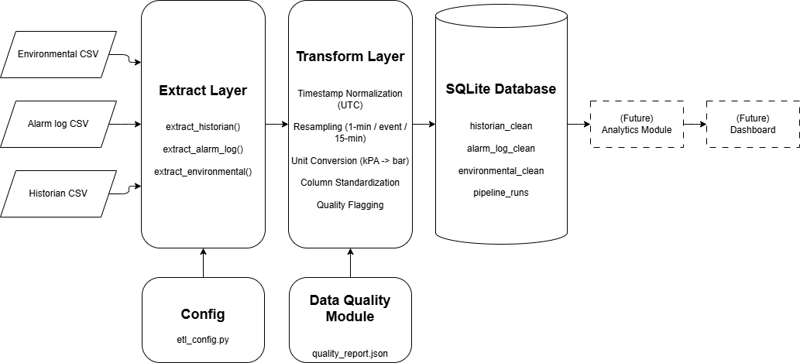

# ETL Pipeline Documentation

## 1. Purpose

This ETL pipeline reads three pump predictive maintenance data sources, cleans and standardizes them, and loads them into a SQLite database for analysis.

- **Historian CSV**: 10 pump assets, 1-minute time-series data for 1 year (5.25M rows)
- **Alarm Log CSV**: Alarm events from pump assets (28.6K rows)
- **Environmental CSV**: USGS streamflow discharge data (resampled to 15-min intervals)

**Input reference:** See `docs/notes/14-etl-pipeline-fundamentals.md` for foundational ETL concepts applied here.

---

## 2. Data Flow



Three source CSVs are extracted, transformed (with quality flagging from pre-generated reports), and loaded into SQLite.

---

## 3. Configuration Parameters

All configuration is in `scripts/etl-pipeline/etl_config.py` as a Python dictionary.

### 3.1 Source Configuration

| Parameter | Historian | Alarm Log | Environmental |
|-----------|-----------|-----------|---------------|
| Path | `scripts/historian-generator/output/synthetic_historian_10x365_1min.csv` | `scripts/historian-generator/output/alarm_log.csv` | `scripts/usgs-weather-analysis/output/usgs_raw.csv` |
| Frequency | 1-min | Event-based | 15-min |
| Timestamp column | `timestamp` | `activation_time` | `datetime` |
| Target timezone | UTC | UTC | UTC |

### 3.2 Unit Conversions

| Asset | Column | From Unit | To Unit | Factor |
|-------|--------|-----------|---------|--------|
| P-0700 | `suction_pressure_bar` | kPa | bar | 0.01 |
| P-0700 | `disch_pressure_bar` | kPa | bar | 0.01 |
| P-0700 | `diff_pressure_bar` | kPa | bar | 0.01 |

### 3.3 Column Mappings

**Historian:**

| Input | Output |
|-------|--------|
| timestamp | timestamp |
| asset_id | asset_id |
| flow_m3h | flow_m3h |
| suction_pressure_bar | suction_pressure_bar |
| disch_pressure_bar | disch_pressure_bar |
| diff_pressure_bar | diff_pressure_bar |
| motor_temp_c | motor_temp_c |
| motor_power_kw | motor_power_kw |
| vibration_mm_s | vibration_mm_s |
| speed_rpm | speed_rpm |
| failure_type | failure_type |

**Alarm Log:**

| Input | Output |
|-------|--------|
| activation_time | timestamp |
| asset_id | asset_id |
| alarm_tag | alarm_tag |
| alarm_description | alarm_description |
| alarm_type | alarm_type |
| priority | priority |
| duration_min | duration_min |
| area | area |
| operator_id | operator_id |
| is_test_case | is_test_case |

**Environmental:**

| Input | Output |
|-------|--------|
| datetime | timestamp |
| 60 | discharge_cfs |

### 3.4 Quality Report Paths

| Source | Path |
|--------|------|
| Historian | `scripts/historian-generator/output/data_quality/historian_quality_report.json` |
| Alarm log | `scripts/historian-generator/output/data_quality/alarm_log_quality_report.json` |
| Environmental | `scripts/usgs-weather-analysis/output/data_quality/usgs_quality_report.json` |

---

## 4. Input Schemas

### 4.1 Historian CSV

| Column | Type | Description |
|--------|------|-------------|
| timestamp | datetime | Measurement timestamp |
| asset_id | string | Pump identifier (P-0100 through P-1000) |
| flow_m3h | float | Flow rate (m^3/h) |
| suction_pressure_bar | float | Suction pressure (bar) |
| disch_pressure_bar | float | Discharge pressure (bar) |
| diff_pressure_bar | float | Differential pressure (bar) |
| motor_temp_c | float | Motor temperature (°C) |
| motor_power_kw | float | Motor power (kW) |
| vibration_mm_s | float | Vibration velocity (mm/s) |
| speed_rpm | float | Shaft speed (RPM) |
| failure_type | string | Failure label (none, bearing, insulation, cavitation) |

### 4.2 Alarm Log CSV

| Column | Type | Description |
|--------|------|-------------|
| activation_time | datetime | Alarm activation timestamp |
| asset_id | string | Pump identifier |
| alarm_tag | string | Alarm tag name |
| alarm_description | string | Alarm description |
| alarm_type | string | Alarm category |
| priority | integer | Priority level (2, 3, 4) |
| duration_min | float | Duration in minutes |
| area | string | Plant area |
| operator_id | string | Operator ID |
| is_test_case | string | Test case flag |

### 4.3 Environmental CSV (USGS)

| Column | Type | Description |
|--------|------|-------------|
| datetime | datetime | Observation timestamp (UTC) |
| 60 | float | Streamflow discharge (cfs) |

---

## 5. Output Database Schema

Database: `scripts/etl-pipeline/output/etl_pipeline.db`

### 5.1 historian_clean

| Column | Type |
|--------|------|
| id | INTEGER PRIMARY KEY |
| timestamp | DATETIME NOT NULL |
| asset_id | VARCHAR(50) NOT NULL |
| flow_m3h | FLOAT |
| suction_pressure_bar | FLOAT |
| disch_pressure_bar | FLOAT |
| diff_pressure_bar | FLOAT |
| motor_temp_c | FLOAT |
| motor_power_kw | FLOAT |
| vibration_mm_s | FLOAT |
| speed_rpm | FLOAT |
| failure_type | VARCHAR(50) |
| quality_flag | VARCHAR(50) |

**Rows:** 5,250,780

### 5.2 alarm_log_clean

| Column | Type |
|--------|------|
| id | INTEGER PRIMARY KEY |
| timestamp | DATETIME NOT NULL |
| asset_id | VARCHAR(50) NOT NULL |
| alarm_tag | VARCHAR(100) |
| alarm_description | VARCHAR(256) |
| alarm_type | VARCHAR(20) |
| priority | INTEGER |
| duration_min | FLOAT |
| area | VARCHAR(100) |
| operator_id | VARCHAR(20) |
| is_test_case | VARCHAR(10) |
| quality_flag | VARCHAR(50) |

**Rows:** 28,661

### 5.3 environmental_clean

| Column | Type |
|--------|------|
| id | INTEGER PRIMARY KEY |
| timestamp | DATETIME NOT NULL |
| discharge_cfs | FLOAT |
| quality_flag | VARCHAR(50) |

**Rows:** 35,100

### 5.4 pipeline_runs

| Column | Type | Description |
|--------|------|-------------|
| run_id | INTEGER PRIMARY KEY | Run identifier |
| run_timestamp | DATETIME | Execution timestamp |
| historian_input_path | VARCHAR(256) | Source path |
| alarm_log_input_path | VARCHAR(256) | Source path |
| environmental_input_path | VARCHAR(256) | Source path |
| historian_rows_in | INTEGER | Input rows |
| historian_rows_out | INTEGER | Output rows |
| alarm_log_rows_in | INTEGER | Input rows |
| alarm_log_rows_out | INTEGER | Output rows |
| environmental_rows_in | INTEGER | Input rows |
| environmental_rows_out | INTEGER | Output rows |
| quality_summary | TEXT | JSON quality flags |
| errors | TEXT | Error messages |
| status | VARCHAR(50) | success or failed |

### 5.5 Data Quality Pre-check (Required Step)

Before running the ETL pipeline, generate quality reports:

1. cd scripts/historian-generator
2. python run_quality_historian.py
3. python run_quality_alarm_log.py

4. cd scripts/usgs-weather-analysis
5. python run_quality_usgs.py

These generate JSON reports that the ETL pipeline reads in the transform layer.

---

## 6. How to Add a New Data Source

1. Add configuration to `etl_config.py`:
   - Add entry to `CONFIG["sources"]` with path, frequency, timestamp column, timezone
   - Add column mapping under `CONFIG["column_mappings"]`
   - Add quality report path under `CONFIG["quality_report_paths"]`

2. Add extract function in `etl.py`:
   - Create `extract_<source_name>()` that reads CSV
   - Return DataFrame

3. Add transform function in `etl.py`:
   - Create `transform_<source_name>()`
   - Apply timestamp normalization to UTC
   - Resample if needed
   - Apply unit conversions
   - Standardize column names
   - Read quality report and add quality_flag

4. Add to pipeline in `etl.py`:
   - Call extract and transform in `run_pipeline()`
   - Add DataFrame to dict passed to `load_to_sqlite()`

5. Add table schema in `create_database_schema()` or let SQLAlchemy auto-create

---

## 7. How to Run

### Prerequisites

- Python 3.9+
- pandas, numpy, sqlalchemy, scipy
- Source CSVs at configured paths

### Run Pipeline

```bash
cd scripts/etl-pipeline

python etl.py

python etl_verify.py
```

Logs to console and `output/etl_pipeline.log`.

### Verify Output

```bash
python etl_verify.py
```

Expected:
- `historian_clean`: 5,250,780 rows
- `alarm_log_clean`: 28,661 rows
- `environmental_clean`: 35,100 rows
- `pipeline_runs`: Latest run status = `success`

---

## 8. Known Limitations

| Limitation | Impact |
|------------|--------|
| Per-asset outliers logged but not excluded | Downstream models must double check outliers |
| Quality reports pre-generated before pipeline | Quality checks not re-run during load |
| `is_test_case` mostly missing | Not suitable for test vs. production filtering |
| Database size ~1.3 GB | Queries may be slow without indexes |
| No incremental load | Full dataset reloaded each run |

---

## 9. File Structure

```
pump-predictive-maintenance/
├── README.md
├── ETL_PIPELINE.md                         (This document)
├── docs/
│   ├── diagrams/
│   │   ├── etl_data_flow.png               (Data flow diagram - PNG)
│   │   └── etl_data_flow.xml               (Data flow diagram - draw.io source)
│   └── notes/
│       └── 14-etl-pipeline-fundamentals.md (Generic ETL reference)
├── scripts/
│   ├── etl-pipeline/
│   │   ├── etl.py                          (ETL pipeline entry point)
│   │   ├── etl_config.py                   (Configuration dictionary)
│   │   ├── etl_verify.py                   (Verification script)
│   │   ├── data_quality.py                 (Data quality assessment module)
│   │   └── output/
│   │       ├── etl_pipeline.db             (SQLite output database)
│   │       └── etl_pipeline.log            (Pipeline run log)
│   ├── historian-generator/
│   │   ├── run_quality_historian.py
│   │   ├── run_quality_alarm_log.py
│   │   └── output/data_quality/
│   │       ├── historian_quality_report.json
│   │       └── alarm_log_quality_report.json
│   └── usgs-weather-analysis/
│       ├── run_quality_usgs.py
│       └── output/data_quality/
│           └── usgs_quality_report.json

```

---
