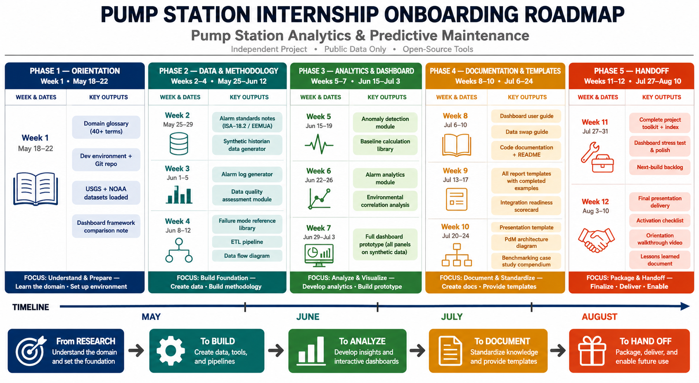

# Pump Predictive Maintenance

This repo holds everything I've been working on during my internship -> notes, scripts, and dashboards on predictive maintenance for centrifugal pumps at water utilities.

I focused mostly on pump fundamentals, failure modes, PI Historian architecture, and .... 

**This is a work in progress - more scripts and notes may be added.**

## What's here

- `notes/` -- Topic-based markdown files (pump curves, failure modes, ESA/MCSA, PI System, dashboard comparisons, etc)
- `glossary/` -- A domain glossary covering pump and monitoring terms
- `dashboards/` -- App scripts (Dash, Streamlit, Panel) for visualizing USGS and weather data
- `scripts/` -- Analysis scripts
- `references/` -- Papers, PDFs, video links I collected along the way