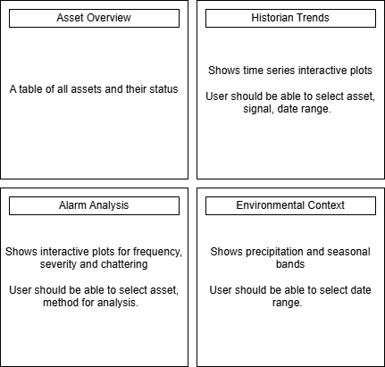

# Dashboard Architecture

---

## 1. Framework Decision

Week 1 evaluation compared Streamlit and Dash; both suitable for mixed-operation dashboards. Dash was selected due to:
(1) deeper Plotly integration with existing analytics code
(2) reactive callback architecture for multi-signal method switching
(3) Python-only implementation
(4) SQLite compatibility via pandas and sqlalchemy

---

## 2. Panel Layout

Panel | Purpose | Inputs | Outputs
--- | --- | --- | ---
1: Asset Overview | Health status of 10 assets | None (static on load) | RAG indicators per asset
2: Historian Trends | Time series with baseline and anomaly flags | Asset selector, signal selector, date range | Line chart with overlays
3: Alarm Analysis | Anomaly flag frequency, severity, and chattering | Asset selector, method selector | Bar chart (frequency), histogram (severity), line chart (flag count over time)
4: Environmental Context | Precipitation and seasonal bands | Date range | Time series overlay

---

## 3. Data Flow Architecture

Data moves through these stages on application startup and user callback.

Stage | Component | Input | Output
--- | --- | --- | ---
1 | SQLite load | etl_pipeline.db | DataFrame (5.25M records)
2 | Baseline fit | BaselineCalculator.fit_hourly() | Baseline + control limits
3 | Anomaly compute | AnomalyDetector (zscore, iqr, ma) | Flag arrays + severity scores
4 | Dash callback | User interaction (asset/signal/date) | Filtered data subset
5 | Plot render | Plotly figure generation | HTML to browser

Baseline and anomaly arrays are cached in Dash memory store to avoid recomputation on each callback.
