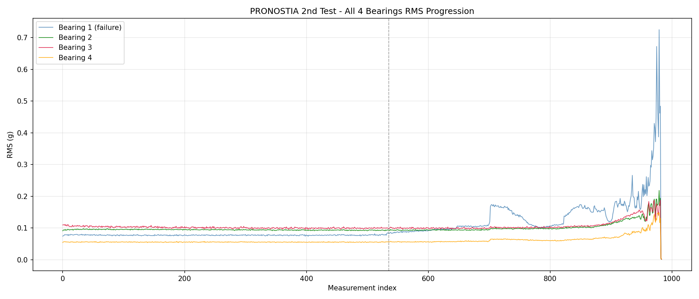
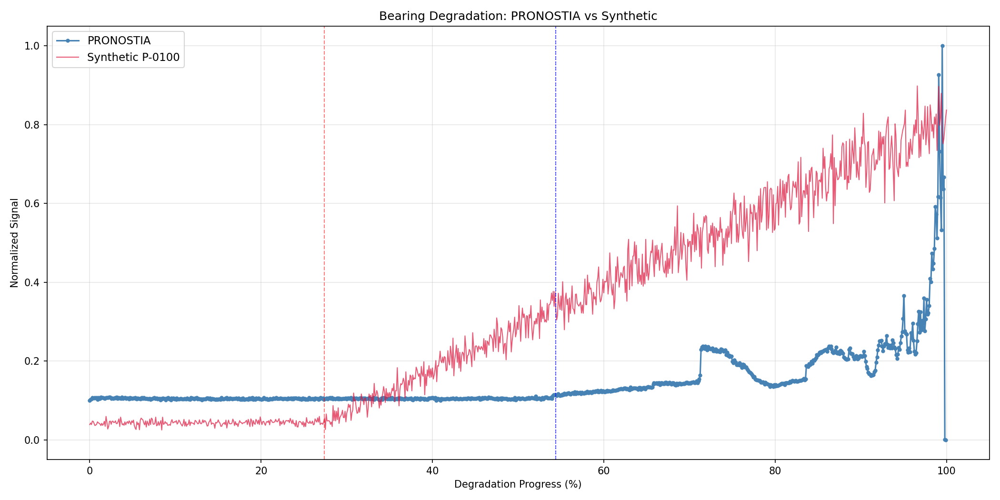

# PRONOSTIA vs Synthetic Bearing Degradation

## 1. Dataset Summary

| Property | PRONOSTIA | Synthetic P-0100 |
|----------|-----------|-----------------|
| Source | NASA accelerated run-to-failure | Pump historian 365 days |
| Measurements | 984 | 525,078 |
| Duration | 163.8 hours | 365 days |
| RMS/Vibration range | 0.001533 to 0.725001 g | 0.0331 to 0.1931 mm/s |
| Sampling | 25.6 kHz raw aggregated | Derived 1-min window |
| Failure mode | Bearing spall | Bearing wear model |

---

## 2. Signal Characteristics

### PRONOSTIA

| Phase | Time range | RMS behavior |
|-------|-----------|--------------|
| Baseline | 0–54% | Flat, mean=0.077 g, std=0.001 g |
| Gradual rise | 54–90% | Slow increase with plateau and fluctuations, reaches ~0.25 g |
| Rapid acceleration | 90–100% | Sharp spike to 0.9 g |

Baseline threshold: 0.080546 g (mean + 3 * std)
RMS increase: 838.6% from baseline mean to peak

### Synthetic P-0100

| Phase | Time range | Vibration behavior |
|-------|-----------|-------------------|
| Baseline | 0–27% | Mean=0.0400 mm/s with noise |
| Degradation | 27–100% | Noisy upward trend to 0.1931 mm/s |

Rise factor: 5.30x from baseline to peak

---

## 3. Early-Stage Degradation

### PRONOSTIA

Within first 54.4% (baseline phase):
- RMS variation: 0.001533 to 0.077244 g (50x range but from low noise floor)
- Standard deviation: 0.001101 g (0.7% of mean, highly stable)

Early degradation barely distinguishable from sensor noise until threshold breach at 54.4%.

### Synthetic

Within first 27.4% (baseline phase):
- Mean: 0.0400 mm/s (stable)
- Noise variation: approximately ±0.003 mm/s (7% relative)
- Transition occurs at 27.4%, then gradual rise begins immediately

---

## 4. Quality Context

| Metric | Historian | Alarm Log |
|--------|-----------|-----------|
| Row count | 5,250,780 | 28,661 |
| Completeness | 100.0% | 91.7% |
| Gaps | 5,247 | 0 |
| Unit issues | P-0700 flagged 136x overage | None |

Alarm Log completeness lowest due to missing is_test_case values and one missing clear_time. Historian gaps injected during generation (0.1% removal rate expected).

---

## 5. Bearing Degradation Profiles

PRONOSTIA shows three distinct phases: long stable baseline, sharp transition, then exponential growth. Total RMS change spans multiple orders of magnitude from noise floor to failure.

Synthetic shows immediate entry to degradation phase at 27.4% with 5.3x rise over remaining 72.6%. Baseline phase much shorter. Less abrupt inflection point compared to PRONOSTIA.

Both signals exhibit degradation progression. PRONOSTIA exhibits longer quiescence followed by faster rate of change. Synthetic ramp is more linear. This reflects difference between accelerated failure experiment and operational pump wear model.

---
